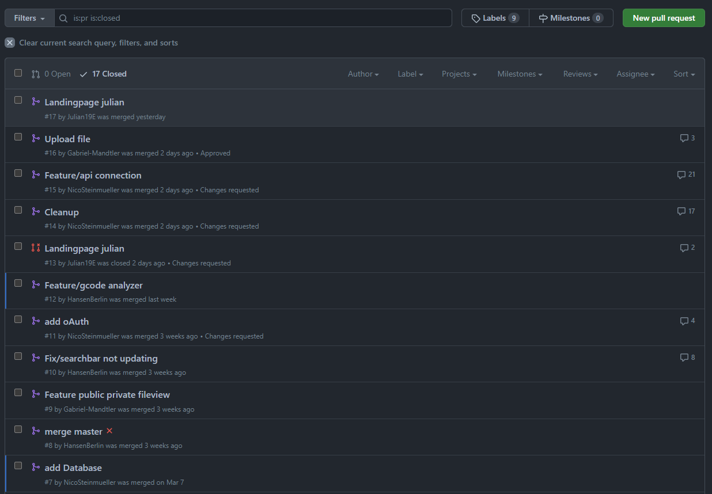

# 3.1 Kollaboration

Unser Vorgehen beinhaltet die Verwendung von Git als Versionskontrollsystem, um die Zusammenarbeit und Verwaltung von Änderungen im Code zu erleichtern. Jeder Pull Request wird von mindestens einem Reviewer geprüft, um sicherzustellen, dass der Code unseren Standards entspricht und alle Anforderungen erfüllt. Das wurde bei uns konsequent durchgesetzt, sondern wurde eher dazu verwendet voneinander zu lernen, da einige Gruppenmitglieder mehr Programmiererfahrung hatten als andere. Wir setzen auch auf Pairprogramming, um bei Herausforderungen in der Programmierung gegenseitig voneinander zu lernen und den Abstand von "Programmieranfänger" und "Programmierexperte" als eine Art Mentoring aufzuholen.  Bei Entscheidungen bezüglich des Designs oder der Architektur der Anwendung treffen wir Abstimmungen, um sicherzustellen, dass alle Teammitglieder in den Prozess einbezogen werden und ihre Meinungen und Vorschläge berücksichtigt werden.

<figure><figcaption>
Beschreibung
</figcaption></figure>
