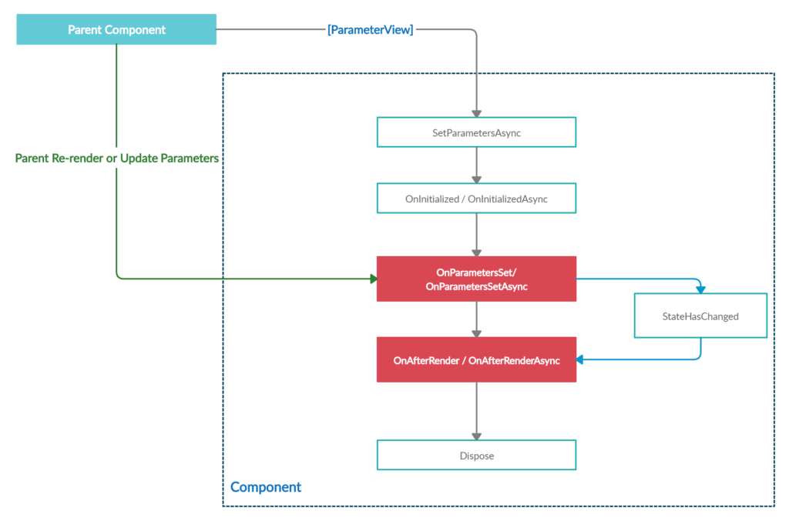

# 4.4.2 Komponentenbasierte Entwicklung

Komponentenbasierte Entwicklung ist ein Ansatz in der Webentwicklung, bei dem die Benutzeroberfläche in unabhängige und wiederverwendbare Komponenten aufgeteilt wird. Diese Komponenten bestehen aus Code, Styling und Markup und können in verschiedenen Teilen der Anwendung wiederverwendet werden.

Das Beispiel zeigt den Bau einer Komponente (oben) und den Aufruf der Komponente (unten) in einer anderen Komponente bzw. hier Page. Dies schafft Übersicht und vermeidet redundanten Code.


```html
<MudAutocomplete
        T="string"
        Immediate="true"
        Label="Suche in verfügbaren Modellen"
        @bind-Value="_selectedValue"
        AdornmentIcon="@Icons.Material.Filled.Search"
        AdornmentColor="Color.Primary"
        SearchFunc="@Search"/>
```



```html
@page "/"
<MudContainer MaxWidth="MaxWidth.Large">
    <MudText Style="padding-top: 50px;" Typo="Typo.h2">Files</MudText>
    <SearchBar 
        FilteredFilesHaveChanged="async (v) => await OnFilteredValueChanged(v)"/>
    <MudGrid Style="margin-top: 25px;">
        ...
    </MudGrid>
</MudContainer>
```


In .NET Blazor wird für eine Komponente mindestens eine .razor Datei benötigt, die das Markup und ggfs. Code enthält. Dieser muss mit @ { ... } annotiert werden, die gesamte C# Klasse mit @code { ... }. Sie kann aber auch in einer eigenen Datei ausgelagert werden, die dem Namensschema komponentenname.razor.cs folgen muss und als partial class angelegt werden muss (s. Beispiel). Dies empfiehlt ich bei größeren Codebehinds, es gibt jedoch auch Stimmen, die, um eine Splitterung und zu viele Dateien zu vermeiden, alles in einer Datei belassen.

CSS kann inline, als Klasse im Style Tag, in einer globalen CSS Datei oder/und in einer der Komponente zugeordneten CSS Datei nach dem Schema komponentnenname.razor.css angelegt werden. Nach dem Kompilieren wird den erzeugten css Klassen ein Postfix mit ID angehängt um Namenskonflikte zu vermeiden. Wenn innerhalb des CSS Codes C# Variablen referenziert werden, geht dies nur bei inline styling oder Verwendung des style Tags für die Klassendeklaration, weil eigene CSS Dateien nicht dynamisch zur Laufzeit ausgewertet werden können.



```html
@attribute [Authorize]
<MudContainer MaxWidth="MaxWidth.Large">
    <MudText Style="padding-top: 50px;" Typo="Typo.h2"> @Localization.PagesIndexTitle</MudText>
    <div style="width: 100%; display: flex;">
        <div style="width: 100%; margin-right: 20px; ">
            <SearchBar 
                Search="@Vm.UpdateFilteredFiles" 
                SelectedSearchValue="@Vm.SelectedSearchValue" />
        </div>
        <div style="display: flex; flex-direction: row-reverse; align-items: flex-end; gap: 10px"> 
            <FileAccessFilter 
                FiletypeHasChanged="async f =>  await Vm.UpdateFilteredFiles(f)"
                Status="Vm.FileAccessStatus"
            />
        </div>
    </div>
    <MudGrid Style="margin-top: 25px;">
        @foreach (var file in Vm.FilteredFiles)
        {
            <MudItem xs="3" Style="padding: 0; margin: 0;">
                <MudContainer
                    Style="padding: 0; margin: 0;"
                    Class="d-flex align-center justify-center mud-width-full">
                    <FileCardPreview
                        File="@file"
                        ButtonClicked="OnButtonClicked"/>
                </MudContainer>
            </MudItem>
        }
    </MudGrid>
</MudContainer>
```


Im Beispiel ist zwischen Zeile 18 und 29 der Aufruf von nativem C# Code innrhalb des Markups zu sehen. Die Annotation @ und der durch geschweifte Klammern definierte Scope sind hier wichtig.&#x20;


```csharp
public partial class FileGrid
{
    [Inject]
    private NavigationManager NavigationManager { get; set; }

    [Inject]
    public IFilesGridViewModel Vm { get; set; }
    
    [Parameter]
    public string UserId { get; set; }

    protected override async Task OnAfterRenderAsync(bool isFirstRender)
    {
        if (isFirstRender)
        {
            Vm.FilesChanged = EventCallback.Factory
                .Create(this, async () => await InvokeAsync(StateHasChanged));
            await Vm.Init(UserId);
        }
    }
    
    private void OnButtonClicked(string fileId)
    {
        NavigationManager.NavigateTo($"/model/{fileId}/{UserId}");
    }
}
```


In der zugehörigen Klassenkomponente sind drei wichtige Konzepte des Frameworks zu sehen:

* Parameter (Z. 10)
* Dependency Injection (Z. 4 und 7)
* Component und Service Lifetimes (Z. 12 - 20)
* eventbasierte Architektur (Z. 16 & 17, s. [#komponentenbasierte-entwicklung](4.4.2-komponentenbasierte-entwicklung.md#komponentenbasierte-entwicklung "mention"))

### Parameter

Komponenten oder Seiten, welche andere Komponenten instantiieren, können diesen über Parameter bestimmte Startwerte übergeben (ähnlich eines Konstruktors). Eine Veränderung des Wertes führt zum Rerendering der Komponente (und ausschließlich den betroffenen Teilen des DOM). Im Beispiel der Searchbar sieht das Codebehind in der Datei SearchBar.razor.cs so aus:

```csharp
public partial class SearchBar
{
    [Parameter]
    public EventCallback<List<FileModel>> FilteredFilesHaveChanged { get; set; }
    ...
}
```

Auf der Page Index.razr (s.o.) wird vor der schließenden Klammer `>` des öffnenden Tags `<SearchBar` der Wert des Parameters gesetzt (hier eine Callbackfunktion). Parameter müssen mit dem `[Parameter]` **Decorator** versehen werden, **public** sein und über einen **getter und setter** verfügen.

### Dependency Injection

Blazor Komponenten und die dazugehörigen Klassen sind per se statisch und entsprechend für Konstruktor- oder Methodinjection nicht  geeignet. Da DI inbesondere in den Webframeworks von .NET inzwischen integraler Bestandteil ist, wird diese in Blazor über eine Annotation der entsprechenden Property realisiert. Voraussetzung ist, dass de Service zur Compilezeit im Einstiegspunkt registriert wurde:&#x20;


```csharp
...
builder.Services.AddScoped<IFilesGridViewModel, FilesGridViewModel>();
...
```


Der Aufruf `.AddScoped` ist neben Transient und Singleton eine Methode, die den Scope definiert. Im Rahmen von Blazor Server wird die selbe Instanz des Service hier für alle Komponenten injected, welche der Session zugeordnet sind. Singletons machen nur für Services Sinn, die komplett stateless sind, da sie über alle Sessions hinweg geteilt werden. Der Scope ist je nachdem ob Blazor Server oder WASM genutzt wird anders definiert, was aber an dieser Stelle nicht weiter ausgeführt werden soll.

### Lebenszyklen der Komponenten

Die feingranularen Lebenszyklusphasen geben Entwicklern eine präzise Kontrolle über den Zustand einer Komponente und ermöglichen es ihnen, benutzerdefinierten Code in bestimmten Phasen auszuführen. Es besteht eine feste Reihenfolge beim Bauen einer Komponente, die beim Überschreiben der Methoden beachtet werden muss um unerwünschtes, insbesondere nebenläufiges Verhalten zu vermeiden.

| Stage         | Methode              | Aufrufreihenfolge |
| ------------- | -------------------- | ----------------- |
| SetParameters | SetParametersAsync   | 1                 |
| Initialized   | OnInitialized        | 2                 |
| Initialized   | OnInitializedAsync   | 3                 |
| ParametersSet | OnParametersSet      | 4                 |
| ParametersSet | OnParametersSetAsync | 5                 |
| AfterRender   | OnAfterRender        | 6                 |
| AfterRender   | OnAfterRenderAsync   | 7                 |
| Dispose       | Dispose              | 8                 |
| Dispose       | DisposeAsync         | 9                 |

Über den Aufruf StateHasChanged(); in einer Komponente wird bspw. ein Rerendering erzwungen, wodurch OnAfterRender aufgerufen wird. Wird nun in dieser Methode ein Parameter geändert, welcher im Markup referenziert wird, führt dies zu einem neuen Rerendering und damit zu einem "Renderloop".&#x20;

<figure><figcaption><p>Quelle: <a href="https://executecommands.com/aspcore-blazor-lifecycle-methods/">https://executecommands.com/aspcore-blazor-lifecycle-methods/</a></p></figcaption></figure>

Auch das Handling dieser Prozesse zwischen Parent und Child Komponenten muss beachtet werden. Wird der State einer Childkomponente innerhalb dieser geändert, wird auch nur die Komponente selbst neu gerendert (bzw. die Teile des DOM die verändert wurden).  Soll hingegen auch die Parentkomponente angpasst werden, muss hierfür ein Callback an eben diese genutzt werden. Änderungen in den Parentkomponenten die auch die Kinder betreffen informieren diese hingegen wiederum, um ggfs. ein Rerendering auszulösen.
