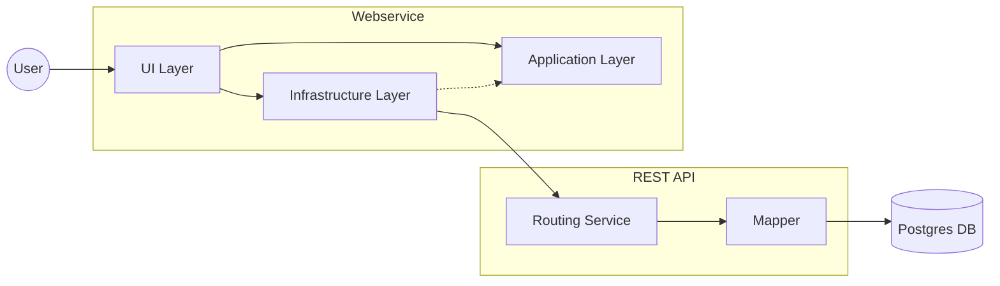

# 5.2 Services

Die Anwendung wird in "klassischer" Fullstackarchitektur umgesetzt, also einem Projekt für die Umsetzung der Webseite, einem Projekt für die REST API, sowie einer Datenbank. Die Spezifika von Blazor Server wurden bereits beschrieben und finden sich im Webservice in den Subprojekten wieder, welche in vereinfachter Form die Layer des Clean Architecture Ansatzes abbilden. Die backendseitige Geschäftslogik (Use Cases) befindet sich im Applicationlayer, die Verbindung zum REST Service wird über das Repositorypattern, befindlich im Infrastruktur Layer, realisiert. Innerhalb des REST Service gibt es im Wesentlichen zwei Komponenten: Den Routing Service, welcher die Endpunkte bereitstellt und die Objekte zu JSON serialisiert, sowie einen Mapper und Querymanager, welcher die Transformation und Abfragen zwischen Datenbank und Routing Service übernimmt.

