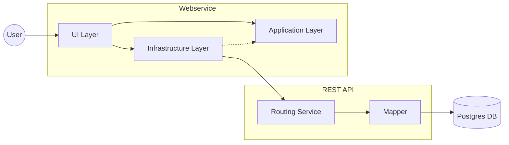

# 5.1 Services

```mermaid
flowchart LR
        217888["Mapper"] --> 107886[("Postgres DB")]
	458868(("User")) --> 1["UI Layer"]
	176892["Infrastructure Layer"] --> 793867["Routing Service"]
	subgraph 252661["Webservice"]
		1 --> 176892
		1 --> 930822["Application Layer"]
		176892 -.-> 930822
	end
	subgraph 490603["REST API"]
		793867 --> 217888
	end

```
