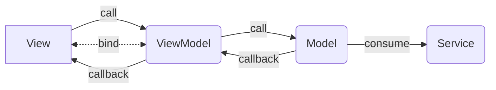

# 5.3.1 MVVM

Der MVVM-Ansatz (Model-View-ViewModel) ist ein Entwurfsmuster, das häufig bei der Entwicklung von Anwendungen mit Benutzeroberflächen verwendet wird. Es ist insbesondere nützlich, um die Logik der Anwendung von der Benutzeroberfläche zu trennen. Die Architektur ermöglicht durch die geringe Kopplung der Komponenten vor allem eine erhöhte Test- und Wartbarkeit, führt jedoch - insbesondere wenn auch eventbasiert gearbeitet wird - eine weitere Abstraktionsebene und somit Komplexität ein. Deshalb wurde der Ansatz in diesem Projekt nur exemplarisch und niht für alle Komponenten umgesetzt.

In der MVVM-Architektur gibt es drei Komponenten:

* Model: stellt die Daten und die Geschäftslogik Ihrer Anwendung dar.
* View: ist die Benutzeroberfläche, die dem Benutzer angezeigt wird.
* ViewModel: ist ein Zwischenschicht zwischen Model und View. Es enthält die Logik, die für die Interaktion zwischen Model und View benötigt wird.

Das Model in der MVVM-Architektur ist in der Regel eine Low-Level-Komponente, da es sich um eine Komponente handelt, die Daten und Geschäftslogik enthält und normalerweise keine Kenntnis von der Benutzeroberfläche hat. Das Model ist unabhängig von der Art und Weise, wie die Daten präsentiert werden, und es enthält normalerweise keine spezifischen Anweisungen zur Benutzeroberflächengestaltung.

Die View und das ViewModel sind dagegen höherstufige Komponenten, die sich auf die Darstellung der Daten und die Interaktion des Benutzers konzentrieren. Die View ist eine Komponente, die die Benutzeroberfläche bereitstellt und normalerweise auf Benutzerinteraktionen reagiert. Das ViewModel ist eine Zwischenschicht, die zwischen der View und dem Model vermittelt und normalerweise spezifische Logik enthält, die für die Anzeige von Daten in der View und die Interaktion mit dem Benutzer erforderlich ist.

In Blazor ist MVVM qua der zugrundeliegenden Architektur quasi "vorgesehen", wenn auch es natürlich möglich wäre z.B. MVC zu verwenden. Model und ViewModel werden als native C# Klassen erstellt und als Services registriert. Das ViewModel wird in die View injected (über Annotation), das Model in das ViewModel über klassische Constructorinjection. Services (wie bspw. Repositories) werden vom Model konsumiert, welches dann ggfs. für weitere Aufgaben wie z.B. Datencaching verantwortlich ist.

Die Updates zwischen den Komponenten von LowLevel nach HighLevel erfolgen i.d.R. über Callbacks (s. [4.4.4-signalr-und-websockets.md](../../4-entwicklungsumgebung/4.4-framework-spezifika/4.4.4-signalr-und-websockets.md "mention")). In anderer Richtung können die Aufrufe direkt erfolgen. Alternativ bzw. ergänzend kann auch unidirektionale oder bidirektionale Databindung eingesetzt werden.

