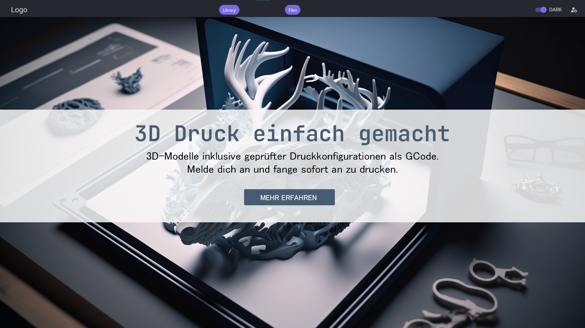

# 6.1.1.2 Entwürfe und Entscheidung

Nachdem wir uns für die Umsetzung einer Landing Page entschieden haben, geht es darum, anhand unserer Kriterien einen Entwurf für die Landing Page zu erstellen. Hierzu lassen wir uns zunächst eigene passende Bilder mit Hilfe von "Midjourney" generieren. Midjourney ist ein KI-Tool, das sich auf die Generierung von Bildern mittels Künstlicher Intelligenz spezialisiert hat. Wir beschreiben der KI in kurzen Stichpunkten, welche Vorstellung wir von einem Bild haben, und diese liefert dann mögliche Entwürfe. Ein passendes Bild herauszufiltern, erfolgt dann nach dem "Trial-and-Error"-Prinzip.

Im Nachhinein bearbeiten wir die generierten Bilder mit Photoshop, um Anpassungen wie die Helligkeit des Bildhintergrunds und die Zentrierung des Objekts im Bild vorzunehmen. Ein erster Hintergrundbild (Hintergrundbild 1) und ein zweites Hintergrundbild (Bild 2) sehen dann wie folgt aus.&#x20;

Bild das ein Gerät und entstandene Figuren darstellt.&#x20;

<figure><figcaption>
Hintergrundbild 1
</figcaption></figure>

Das dargstellte Bild, hat die Ähnlichkeiten mit einem 3D-Drucker. Die Farben finden wir in dem Beispiel sehr ansprechend, da sie durch ihre Darstellung eine warme Wirkung auf uns haben. Wir entscheiden uns jedoch gegen den Entwurf, da das Bild nicht den typischen 3D-Druck darstellt.&#x20;

Die von uns generierten Bilder, einschließlich des ersten Bildes und der anderen, die wir mit Midjourney erstellt haben, haben wir in eine PowerPoint-Präsentation eingefügt. Dort konnten wir Anpassungen an Schriftarten, Farbauswahl und Button-Design ausprobieren. Das Zwischenergebnis (Hintergrundbild 2) sah dann wie folgt aus.

<figure><figcaption>
Hintergrundbild 2
</figcaption></figure>

Die Überschrift wird hier in auffälliger Größe dargestellt und die Buchstaben sind vertikal angeordnet, um die Lesbarkeit zu verbessern. Unterhalb der Überschrift befindet sich ein kurzer Text, der weitere Informationen zur Webseite liefert und in einer anderen Schriftart dargestellt ist. Darunter befindet sich ein auffälliger orangefarbener Button, der als "Call-to-action" fungiert. Diese Aktion ist als auffälliger Button gestaltet und soll den Nutzer dazu animieren, darauf zu klicken und zur Webseite weitergeleitet zu werden.

Ein weiteren Entwurf (Entwurf 1) den wir erstellt haben, fanden wir von motiv sehr Ansprechend, nur was durch die Zentrierung des Bildes  schwer einen text mit hinein zu bekommen. Für die umsezung wurde daher ein Banner mit dem Infos Text vor das Bild geschoben.&#x20;

<figure><figcaption>
Entwurf 1
</figcaption></figure>

Wir hatten uns dann aber gegen diesen Entwurf entschieden, daher das der Kern des Bildes durch den Text mit verdeckt wird, auch wenn die umsetzung als Praxisbeispiel auch funktioniert hätte.&#x20;

Die verschiedenen Entwürfe (im Anhang) wurden von der Gruppe betrachtet und diskutiert. In Teams haben wir uns dann auf einen Entwurf geeinigt und begonnen, ihn umzusetzen.

Der finale Entwurf (Entwurf 2) wurde wie geplant umgesetzt und integriert. Wir haben ein Logo in gelber Schrift oben links erstellt und die Menüleiste in einfachem Schwarz als Übergang zum Bild dargestellt. Die Farbe der Buttons wurde aus einem hellroten Teil im Bild des 3D-Druckers generiert.

<figure><figcaption>
Entwurf 2
</figcaption></figure>
