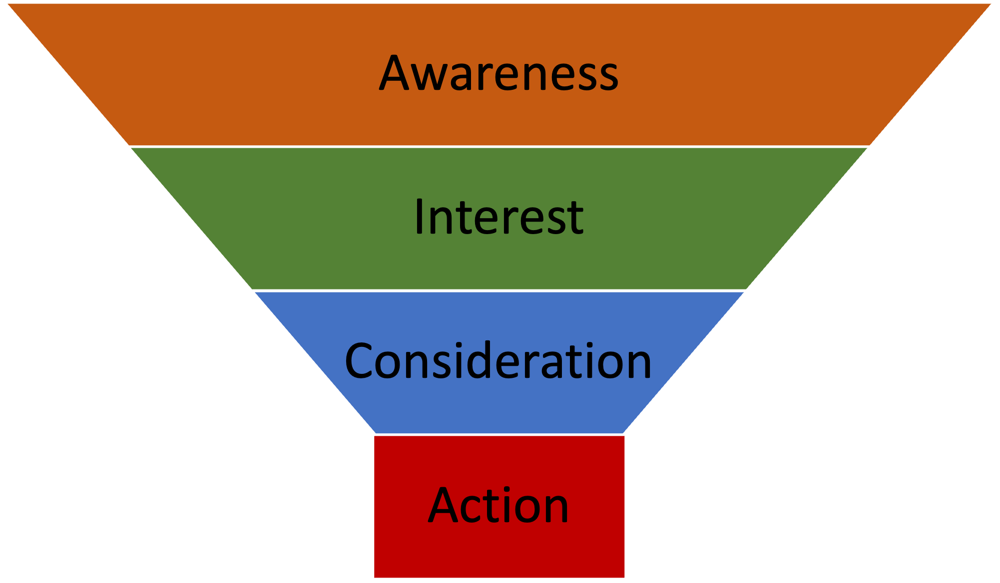

# 6.1.2.1 Customer User Journey

Um auch den Aspekt der User Experience (UX) einzubeziehen, haben wir uns Gedanken zu einem einfachen Userflow gemacht, um neue Nutzer von unserem Service zu überzeugen und zu einer Conversion in Form einer Registrierung zu bewegen. &#x20;

Eine Customer User Journey stellt den Prozess dar, den ein Kunde bei der Interaktion mit einem Unternehmen durchläuft. Die Customer User Journeys sollen dabei helfen zu verstehen, wie Kunden mit ihren Produkten interagieren und wo Verbesserungen vorgenommen werden können, um das Kundenerlebnis zu verbessern und die Kundenbindung zu erhöhen.&#x20;

Allgemein sehen die Phasen einer Customer User Journey (in der Grafik als Purschars Funnel dargestellt) so aus:

<figure><figcaption>
Bild mit der Anlehung an den Purschars Funnel
</figcaption></figure>

Die Phasen werden hierbei wie folgt beschrieben:

1. Awareness\
   Der Kunde ist sich bewusst das er ein Problem hat und etwas benötigt.&#x20;
2. Interest\
   Der Kunde Zeigt Interesse an einen bestimmten Thema oder einen Produkt&#x20;
3. Consideration\
   Der Kunde beginnt nach einer möglichen Lösung zu recherschieren und Angebote zu vergleichen&#x20;
4. Action \
   Der Kunde trifft eine Kaufentscheidug und startet den Kaufprozess&#x20;

Wir haben daraus einen Userflow abgeleitet der im folgenden Kapitel dargestellt wird.

\
\

