# 6.1.2.2 Beispiel anhand unserer Webseite

Wir haben im vorigen Abschnitt nun definiert was die Customer User Journey ist uns aus welchen Phasen sie besteht. Nun wenden wir die Erkenntnis auf unsere Webseite mit an:

```mermaid
flowchart
	391658{"bereits eingeloggt?"} -->|"ja"| 343071["Anzeige FileGrid"]
	391658 -->|"nein"| 700234["Anzeige Homepage mit Button #quot;mehr erfahren#quot;"]
	343071 --> 992006((("Erfolg")))
	479168(("Start")) --> 621334["Aufruf Startseite"]
	621334 --> 391658
	700234 --> 387100{"CTA erfolgreich?"}
	387100 -->|"ja"| 731173["Vorteilsseite / USPs"]
	387100 -->|"nein"| 436912((("Fail")))
	359832["Button #quot;REGISTRIRUNG#quot;"] --> 630412{"CTA erfolgreich?"}
	630412 -->|"ja"| 270089["Registrierung Formular"]
	630412 -->|"nein"| 436912
	270089 --> 263474{"erfolgreich?"}
	263474 -->|"ja"| 343071
	263474 -->|"nein"| 436912
	subgraph 731173["Vorteilsseite / USPs"]
		843284["Problem und Lösung 1"] -.-> 748854["Problem und Lösung 2"]
		748854 -.-> 359832
	end

%% Mermaid Flow Diagram Link
%% Keep this link to make future edits to your diagram
%% https://www.mermaidflow.app/flowchart#N4IgZgNg9g7iBcoB2UAmBTAzgg2qGAlqgC4AWCAjAMwBsANCKegQOanGW0NEIhUCcFGgFYAHCAYAHKJgLECUJAlAAPBMIAMGhgE8EVIQF8GqAIbFTykBFMAjdBF72ATs2KYABMyQsHUFizEAPwgxiDEOpLovM6kUAC2tgCumAByaNEMmA7oAMbE6KgIYKYQ2VIycgpIAIK2mFAQSQVWavCa2iB68AY0YajOpgEEPsWl2cb4RGQIAEwaogxMrOyUFLPcRfB8ACxUGgDsFBIg0rLyiq0IBwIAdMI7sxSiB480VDtCunM7O7ezwgOT1EVFEO34NAOB365ksiGsdgcvBqSAAXsxfB4AGIECDoADizh4YQiURieQsPjx6QwJ2yePyhTGZXQFXO1TqDSaLXhbRu-Huj2er1m70+9C6Pz+AKBz1B4Mh0JMg2Go3gJRZkxAhBI5Hg80WjAxq3gFHWm14By0sw+JzOVUuvOuv1uwuENC0B3dQOE33gnwFomENo0O2DEIONB2MIsVhs9kc2xR6NY6A8AAkEuhJEM0-E5B4AELNYiKDwAHRA8XQpGcXmcJVr6CQldCDFJ0W2rnypip6BpmRA9IpTPV41Zp0qF1q9UazU7qmdfzdHsO3oBfoDtyDIbDswjUf6KpYIxYzImdCmus4EuWbA4pq4IB4234-HmGhodqn1Su8H4Ly3B6miiDQ-BaDQ6y+pKj6zLckaiLMryiBoFAaACNCiDGcKgPGSLbAAog2jRniSkSdiAqBQEkth4gAwgQzi5NSGR0jkjJbBq5SUcep7nhO9rTpyc48ou-6AcBCxgRBUF+tQcEIUhOwoWhGFYVqOozI+t7Gg+1ASi+IA7AcgiYd+7KOmJoiiP8Hr8AG4EUDsYESt0VBUMItz7CIsw2maQZUEqlGwnGiKJiAADKFjOBwZFktsuSMcx-asVk7EFJx47KkMJ5qlxAk-oowncguIBtNZtkaPZFBvqhzkQn67med5wZ+c8wiBYYGnTHqBpLLpawbM+WwgDQTzuTs5kOkoTr6laXnCPwDwAXsgiiPwjW0P8HmLZhnxHAB2GhQmyJJGAzhnR4UWmDF2RyNEcUUd2lIsCxtJpQyGX8dlqpnmOLJstNxXzn+SEaAtS3gmCAjPBtMHuTQ23CLtYIUAd6mXtqPU3v1Kx6U+hmgkcWhTdOf5oRQnnGTcvkmSIAEUJuqH-FaojUPwVA2sGQVmLG8J4eFdEACo1PWYAka4BC5KQISPTEcSJCkA5sZ9o75T9uV-erk4WTOXIg7NFNU1CnNIRCi1s0zFAsws7Ocx5SFdZjml6vsQ13iazmGoZNxmjcpO-obgUCiZaM7Y8AhAn6AC082w4CKHuQBCw8yF-NhbwABqUAxcwZR3QUHgAPQeAAqhFAAK2AMCgGDYPAOAgNDsxgicyFBpNDAeQBnMgAAulIN3NsQABKvYANYIJ0gxIJPppy9smA0SwgySOQH0jplAM8TlfH-dxgkcrOJXk8H8GCDcyMR-wUcwbH4PxwcicCChLxhJgER4lYLv6OhuP3ggL2YRXCyFRHvfK3VrzaX-iafSFptjvFDOsAOlkyqUCvl5HYGhkaoVhmCaC3QxqeTRlCL0iDVL8COunE62xhai3QMRCAK9mDS1lu2ci8sEjJDSKlIc6U1ZZR3r9b6OsgbHwNmJSmDxMHYM0P5FaBCEBENdKQsh+wKFOyvFpPqRo8aDXgSAMGCx+AoJmpIp+VBtxPCWutJaHMhrdHBODZyNVMImSWp+D4VDcIZ22CPdAJ4P5EgYUkHw2Ic7xCSDYZwbZwgcK7BSXsr0UrvT4arLe3EBi7zyoIw+RVxGiTQaaCxViapiDfItTmm5wK3BcRCF4FTPHRkgVpOBuiAHQOGrwUUHxXimPJihcGDwOpaA6g7KpMEkIHHghoAQdUPSU1md4hENCQAMPFkwyWrDYkdk4YrHhqThwcREVk4R+8Cq62BoUtozwtCChGdgpqNoHFzChDMuZTkFmaCoJorGUC2ke3xgZEaewwLIMBmTWaUZraOUBMpNCN99x+hQp5MasyoQPHWtgrCJg04+NWViUwuIdnxMotRWi6AGJMTeoOI5X1zka3AbkwqesRKlTaNC24sLkIIqBHDboKKgLzECl6ZS4ExC-J-vqBYMC9Lmi6dsZurcIWBzEspICcjhRHGsiZZyfoPT3HcahV+RwDCzGWQLXgFdnBQApfEDwoTUAeAADIADel5hOOIPVwSBR4T0oAvEAz0kk0pVpvEReTWUn0No8Gyvx2p7Cci3YQjM74CjspCMaAJRRQmUkebJWtclD19crbYvsw5ti0b1GV7TYHyp9spDu-TZrOSAh5VckYwI32eK5OYzNIJiHqi3d8JCLW+JANa21eJ7WOpde60JLAPCzDtMWv1s8A3sPikGxJfZlYb2OQyoRmsI0squeyygbxalIQRvsDm9kdhyQMFesamF1rgiwZQ71w9S0gHLf7Fp1bDSAv0QqvgFte4qtQW0F0YZE4AUwgBNmho3KzD+C8WgUIhBAg-dGXFfN8X4RAMWYgpYkAVhACPAi+IACSEUhYj2oyPUuqR8StkDcG3dvC6UCO3qc49h7I1nvJo8aU4IMWfGoB3P0AI-h7SqoIdyootA4tOKun9f6qChAHms1Avh654DiVu3IKRSzxBOPEG648GHXRirwKAUQlAMAs84KzzgCJIBGtIEYHBuC+oYaYfI1QADq2NpVZE-qVIJUArMhf+e-aiTEKIwxEOILICXcjoHTL2VAX9thevCDdXwD5dj7COCcaKRWssedyyAfLhlCi+FjgzBYxlenLoYL2AgFn6Xa1RNRjz6A2idG4xkicvMcLPkwARVAVQcnb0tdsAAVpYX5uyEomYSOZyz1norFfs82LbLmGHuc81AbzJxvP+cC4oWL2jhsRasFFmLoWKDxaSIl3gyWxB0nS5l7LNX2sFecEVy01pbTtkK+gYgVWcsUUB-V3T6Bo6aGRiIcpmgTEdaQF18wPHuJ9YG0N-dPXBHjasAQKbM35Bze4gtkASBvChC1GtkAxmP6bac9t5wNm9sOcO65k7vAvO+ou35wY12kC3ereFnQuXQBPfQFLjdQ5fufb2IcfLDR3sZZhzV-LFWoe8DfB+L8EPgdQ913Di7I0GtI-dNg-crxnKaBOJ17reOJwE4wETtJ4bD1k-hBT6bs3C2amZ6Stnpn+c7Zurzg7nOjtuY80Ls7IvfMFHF9OJXYWhwPfhAr7Pr20va4osZUyqWVcl8t908rkPitjWoODoHlX-tW4Mbb6OvlQJPFhuhTTWOcck+3l7wbU9ice7wxNoPVOmVh8xizyPHOqxc553ZvnCeBfJ+2MLnzz4xcBaz6F+YMu5e55tc9uLxePsIPGk3rXiXq95dr+b4rX2K8G+h633gdWbeI+jvZXyMQW2fcTHEAN3XHUbBgEfH3EbE5PFSbYPanUPCYcPIzDbMzDfGPWzbYfbRzZfRPQXbfVPXfS7TPYLI-e7WXSLYgc-RXF7N7a-X9MHTuSvB-L-J-M3EHbYImNCDQZ-FvarCiH-XgDvMEFSFaSmIEV3bHd3SAkAaAsfX3A9bWAPUAafEPfiVbCPdA6PbnXbNfePfAzfU7c7dPK7Q-KBY-XPKgx7Gg6LOgy-VgjLT7F4Xgn7Kvdgwxfgw3MtAwCtTgi3Tw4Q7YDvEQSMOqeTG0aQwfCfeQ-rb3RQ2A-3eA9QpAkROnZbJnefbQ9nDAowrAuPPA5zYwlPUwvfDPA-cgywyg0-Avegq-ZwxVPYFuFg+-HXTwwHD-S0RtB4bwz-QQ7-a3EQv-TFNCSMD9dCaI2QhAGgpIT3eI0feAYbfhOQ1QhAmfGndALQtA3I3Q1fHA9ffIpPEwtPco8wqou7E-ag2gwvBgxo39Ho1o37R-WrPoz7cDTouvF44InTRrDqMhXyPYKEQHcA+lWY+YwnRIlYuA-DdYjQ85bYiiRfPI4ogogwoornQgycMo0gyom7Cgq42wm4+opwpLVwkmBov7AY7YT4l-XgUFQQWkgQ2HQY9vEYyER4AAxDfvMAmQiAkRBQpY8fVYlIyneE7WOnBnEYLI0ABfHQzAvQ2PdE3QrEnfUXCoiXbPKwj+Gw-POwi-VpO4pLD49wtg6krwgI+vfYT4JkwI80+HX-RrRDBYVDayKqHk0E2IwU5Y9JGEqfMUtIhE1ApE+Uo4-YkAXAlUrfbE043EzUgk6w2o-Uhww0yk3gRBG0009o+0t4mkq0YxPol4h04YxrV4dCb5FNFuA4KY-kw9b04Uv08nAM2fWncdTIxE3gZEvY-Qg4ww1E440o2M-feM6owkvU4kxwtoiiDM8FUkos3MoyWgRkwsjooYkIv-fMjqMGUCJaGsoffHBYmA6E5I2E1IlsicSUxnDs9bXYhU8MyMhU1U4g9U84-E0cxM64+w24tMvM5TUAqc74hcnpYyFgj-ectkxrNGGqZSDXQQUAz0uQ+spQ-csbUUxA88hgOnGUwzEM28sMnsiMw4-sp8nE4ciwy4j8okr8kkqc7pMUPpSkwCy0tXUrfXL4oItc34pHGqAQSCKEMEMCPcr0w8qE30k8-09CzYzCtslbYMzs0M-s+8oizE6MtUswsgt8iinUpMic1M0kui3pJ4jw80tiuk7YBk2csC1ciCpHN9NmUMGxIMISxCkSoU5C2ItYs8qSlZQjKUpQLqbTAANwIHQBgGkGwMkV8i8nFSEDEA6Epn5TmEgn+C5iOA6kBCjDhlRCgE2yWKAmsmAnBA8lzUQydkogICGEGHiAAFkodTAAAReAmbZ6QOEAIWQsE4c6RQYgaq8wDPKweQYgGreqiqleUwe1IWOQL+foRiCkAgQKrAXAbTXIBIasX1fTZamwTAbIDasIIPFQcK4gCuXsBwAAeT5wRKAA

```

Auf der von uns erstellenden Webseite, beginnt unsere Customer User Journey mit unserer Problemstellung. Die Fragstellung was ein Kunde nun bei uns sucht (Awareness) ist damit geklärt, weil sich unsere Webseite an eine bestimmte Zielgruppe (technikaffin, mindestens ein bisschn Druckerfahrung). Dies sollte sich auch im "frischen" Design mit KI-generiertem Hero Image widerspiegeln:

<figure><figcaption>
Startseite für nicht registrierte Nutzer_innen
</figcaption></figure>

Die Probleme und unser Lösungsansatz, welche nach einem Klick auf "mehr erfahren" gezeigt werden, haben wir so eingegrenzt (das sind auch die Inhalte, welche der Nutzer im Slider angezeigt bekommt):

<figure><figcaption>
Problem 1
</figcaption></figure>

**Lösung**

* Suchen, Filtern und Anzeigen der Dateien von anderen Nutzern im 3D-Viewer
* Übersicht der für diese Datei vorhandenen GCode Files(erfolgreiche Drucke, Bewertungen, Drucker)
* Detailinformationen zu jeder GCodefile mit Onlinetool zur Überprüfung der Druckgeschwindigkeiten, Materialverbrauch und Temperaturen
* Download der geeigneten Konfiguration als GCode Datei
* Diese kann direkt an den Drucker geschickt werden ohne ein Slicerprogramm zu nutzen

<figure><figcaption>
Problem 2
</figcaption></figure>

**Lösung**:

1. Nutze deinen Slicer, um die besten Einstellungen zu finden
2. Lade deine 3D-Datei hoch und teile sie mit anderen Nutzern
3. Lade vielversprechende Konfigurationen hoch und profitiere von unseren fortschrittlichen Parsing-Funktionen, um das Beste aus deinem Druck herauszuholen
4. Behalte den Überblick über alle Änderungen und dokumentiere deine Fortschritte

Der abschließende CTA fordert zur Registrirung auf:

<figure><figcaption></figcaption></figure>

&#x20;
