# 6.1.3 Basiskomponenten

In diesem Kapitel sollen exemplarisch die Basiskomponenten und Pages zur Anzeige und Suche/Filterung der Dateien und deren Zusammenhang zueinander gezeigt werden. Der einzig wesentliche Unterschied zwischen Pages und Komponenten in Blazor ist, dass Pages eine oder mehrere (eindeutige) Routen haben, über welche Parameter (nur Primitives) übergebn werden können. Komponenten werden hingegen von anderen Komponenten oder Pages genutzt und die Parameter direkt an diese Übergeben. Ansonsten ist der Aufbau wie in Kapitel [4.4-framework-spezifika](../../4-entwicklungsumgebung/4.4-framework-spezifika/ "mention") beschrieben gleich. Die Komponenten/Pages sind:

* FileGrid (Page)
* FileCardPreview (Komponente)
* SearchBar (Komponente)
* FileAccessFilter (Komponente)
* FileCard (Page)
* FilesGridViewModel (C# Klasse)

Das FileGrid bildet den Einstiegspunkt für die Anzeige der Dateien. Es zeigt in einer ersten Übersicht die Dateinamen, den Autor, die Gesamtbewertung und ein Vorschaubild. Die Dateien können nach Namen durchsucht und nach öffentlichen und privaten Dateien gefiltert werden. Ein Klick auf eines der Bilder führt zur Detailansicht. Die Erläuterung der FileCard erfolgt nicht in diesem Kapitel, weil hier bereits der 3D Renderer zum Einsatz kommt, welcher im Kapitel [6.1.7-3d-viewer.md](6.1.7-3d-viewer.md "mention") näher beleuchtet wird. Zunächst eine Übersicht der beteiligten Komponenten und Eventflows (eckig: Komponente/Page, rund: Methode oder Property).

```mermaid
flowchart
	991268["Self"] -->|"Register"| 213669(["FilesChanged Callback"])
	630781(["Search Func"]) ---|"Call"| 932726(["SelectedSearchValue"])
	276152(["<span>UpdateFilteredFiles Callback</span>"]) ---|"Call"| 138172(["UpdateFilteredFiles"])
	991268 -->|"Call"| 163966(["InitFiles"])
	163966 -->|"Call"| 607646["FilesRepository"]
	926742(["<span>ButtonClicked Callback</span>"]) -->|"Navigate"| 349296["FileCard"]
	subgraph 551535["FileGridPage"]
		991268 ---|"Register"| 276152
		482335["FileAccessFilter"] ---|"Invoke"| 276152
		991268 ---|"Register"| 926742
		503335["FileCardPreview"] ---|"Invoke"| 926742
		238250["SearchBar"] ---|"Delegate"| 630781
	end
	subgraph 851546["FileGridViewModel"]
		932726 ---|"Invoke"| 213669
		138172 ---|"Invoke"| 213669
		163966 ---|"Invoke"| 213669
	end
	subgraph 607646["FilesRepository"]
	end
	subgraph 349296["FileCard"]
	end

%% Mermaid Flow Diagram Link
%% Keep this link to make future edits to your diagram
%% https://www.mermaidflow.app/flowchart#N4IgZgNg9g7iBcoB2UAmBTAzgg2qGAlqgC4AWCAnAAwBMANCKegQOanEIBs3DRCIAVgEBGAQGYBIBgAcomAsQJQkCUAA8EAWgAsNAHQ0qR4yaPaBDAJ4JhADmEBfBqgCGxF6pAQXAI3QR+ADECCHQAcQAnIgAFFxZ0KRAUDGx4HEEqMSzJBhoxWxoBKkTtAuzEihpOAHZdRM4xKmr7RJpqzlEaCophKtsQAF0ZFwj0JGIAJRckAGsEKgYI6bn4RwZiS2kE+BBMAFcfFiXpcgZMf3QAY2J0VAQwFwhz5yWWFgIkFnvH55BZeUUygAgj5MFAIHsbp4NPAdPpDKZEeYrDZ7E5dhtQp5CCRyPBqPRGMw2Bx4NxOOjRvIAF4fL7wB5PdBOfBEMhcaqEpisdhcAS2Xh3Ha2EQCbScRL-BRKFSIEAw4TGFGrAro1zuTzePwBHbBUKRIgANQI6BgAFk0P5EsksLgQMIGhRuK1hGJuBREq77JyKmI2lVBsNRuMprN5otljZ0Rstvx9odjqddhdrrdvkyXnF3p9078pYCkCCwRCoXKFUqQNYVTR0ZhMdtWbiOVzibyyfzKVgCLScwyfsy6I32fBGi2eaSaAVBfxOE1OOLJXJpcpoTZ2sI9JxlWJhGsQOqPHKtVbdSEsBN0PmoBFrAwbakcANo5ttrsDkcXCdEudQqmhYzflQV5s3pAD0BkJcCyLcFIQbeU1w6Tdt13Wt62xNk8VHBhuRJBBJxrRYux7UD+xZEAcWHQwBSJccbF6acdiKLIJEXAEZVXMl4URJELErBBtDdNU3EPUBjx1EA9XQABhEZUGiUYADcTTgIMxkmSNVmfWMdlGa5phYUIADlLW-FMbn-ftMzeOlc3Av5IJlaCSzgmFDGVDpqnRaQRjU4yMH4IRRBYsiKLxKjsNbUld0JPgdjyAoilY5dZXUBBRwMbjTF4qttHMISNSPXwTxAABldARkuUgACERklHyQw0vcY1fXT3E+IyTLOMy0z7DN92AmzerzBzgVBGDS1S+AqgWPjOIpVTxj819AvESQQowvCqGonC22ihiQFKPIWIgtiVzLBABGoAxlXMPcD01IrxMkoFLkuLBMD1G4Ijq4N1LDTT1hffhWv0jr-K639zNsqyQOh+zTsLMbnI4sVqKrBoCL+eriCWgLRWCwdyI2qajAi2jViobR9sqGo6hO5KOO4DLMuMbK8JqfKRK8R7+AAHkwbykAAPiqyFiGUKSIAIS4ZluAACGSIAgHwXBl3mAHoBemIWfrU0MViaoGdmkEIIFxiGrihoa7KArNBrA+moKR2COJoKnZty2wvOx3HGPxtbCdCzaZp2qLKf2homhaR32POkdJ2ZlmqDZqaBM5h7tX4MqKtIOXAj2JBLl1hr-sN7S-lN83k0hnqHf6u3ezr-NHOdib4Km2wtw9t3vd+33BH9kB1qbEmQ8imxw5AWKQDaDoBC6GOzsm2cqGu2aaGodPCsznZ+cFoWAFVpHVdBPvQUZUEkzAFceZXVZmDWteF4u-oNrTXxNpWq5-S3a8s+vrKN3-s3UaxYXZxyEGjfi1Q9zeT7iZP2QUA5DjCltMmuFVj0SnkKEAFAeh9CSgWDiEgBCJxZinTgAgt6iR5jsMqEAwBD0BuXEG7V0Df26hZPqttAEkT6iAxGYC24wh3GIZUbt5pY3gf5RBq0mEoODug3ak9p4OjEE6CUi8Urt3yDNKstgxDUO5jvEAABJJACgr4v31lGZhH9K6dWrr-LhgEBpAP4SNQR40XI2F0eIyhvdfIIJACKUQC5h6UVJjRDBip3bTxoK6d0hDY6TWqGI9eeQjFiSCGeTAUlSD6XlorO+MtrGNXfvwT+ZtHFwKCTIkJooFwWz-HDHhsNrZaKcuAyaio0k3WTg4CJqCx7k1iftL0wgfRaOIZwCgN1mhZNoSAI+J8z4XysQtV+tiQDNUqQ48GTiWkdIAe0puniunCN8bM9ys5AmLWCaEsUEohmKOicouJOCKB+k5Jo+GDM469D0dAqgiyTH0OcdnCIlVDSPD2AkTZNiAY7KNhXL+jif5HLrm0+2wDzmtx8Zgtys1KGY1qfc+pjzwmB2JlhN5E5aD7TENoSoTpklL3bnCMQehLp4N5XyvB24BCSPutvYqkkZIRDuHeS0D4nx2LjO+RMpka4uJtm4vhw0EYXIJZy7l-L9VzNmhICkDghggFuPEB8oBdk7EuHsOsUAAC2iRHUjFlhEEq7gIikhAFALYKgGCuoiO6gAokgHBfqxiJA+F9VWBYADqxMiV1ksFiOUdYIhQFlomkee4wR7Cha+L5-pfn5sLQACWmKgNN9pEheviD6hJbpZl1pGA2yt4aa0L2wfwC16BNC2G0NUWokyN7DuKAwaYBBXVWzrtScxGAYQzQxbO-+IrQAEEwCG1A0p3G-GyTscxCks0JEGYTG1IA7UOudYGt159PUjB9ZGgNIAg2hvDfwZ90bxjnzjTKHNkSzhoXTcQTN2biZ5qgAWt6-AJlTN2FBitVaa3CFbREBt-Am1JPWG29AxAO3VtfN26efbNBZHMOor5vQKDaESFOmdf8+rzvDegJdzTV3cOEp4Td27d0arsgesxSBj2yyHmRC9V7xY3tfXej1Xqn3+pdbJsNEbFO8B-Usa4-6k3LuA6ADNJ6AN4kg9Bot+DOD9DOIht6BGu1oYw3Fdc897N4ds6+VD+1SPzg6BZ5O89mh0YsQx1VDBmOLvDIcjjgEuNyh4zuxQe6BNLIvO8Os58xPnpRZJp1Sng33vk5+tTMm8sRBU4VqN6nY1aeUEZzaQHU1wQM+B3NtZrOvkOuUKzpm3OwZc42pz3b62ueQ0R6NODSMilsNUcQK9hCssnUFtwjHfhhdYxFldy2bYxY3Vu+LOK+qCaPSejL1qsv2qk7l91D7vXlZfW+8+ZWdhfsq7+6rSBask3q2m-ToHDMQda6Z-geDegWe-G1nrcU+tA6qLUQbuH8Mjd6551A8Q4TaFdLlRUQgxCBenUtkLIBVtsci5t5w22p67b43DQTKXN1fRO8i8u2XpP3bk4+27l2Hsfqe0VmNr2E06a+4137zXhwmcLQFTInWEPdcRzsDzOz4fQ9pnD9Dw3O2jeR6jycmQYHo-R8nXHwW4ZE-W5w1p5O4tU+OYd4Tx2z2naZ+dnLt6SvXYUxV4r77VOe755pgXI9k16YxGB9AH3xcwbivkQoE6ZdIY10jxXaufWR2aArobCOE+Q61-22ZnAqJ+l0H6I3+OTcLrW-AZd5vjnrop7xhL-GGCCYACIXBYEthnEnncs9k+7jnrvveVKgDG79VWA+AYxA1zwTWw--a6xLnYwOCHz5s3L2tOHk+YcSS2jf7a18K5Iyj-twPmhuzEM0abJeot2VN5X9jpP9yW8pw36nyX0Cpfpw7xnr5mec7ZzdnnT3VnR7X1XnDTP9GrQXSfb7EPP7FrFfV8VPaOOPVfLPGeKHRfb5AMXfdXQjRPQ-VHXcRoWmJlIdHIEAejUvY5W-KvFVC3AqHbevfbfdJZYpTvM7a9P-PvQAu7ZTbnUA33cAt7D7IPKfEDUPcPAHBfGeAbMHWXNA1XBze0fIUdPrCHdfHtHYUjXoPXWwCgVGfkK-B-Gg+-AnWvK3F-G3Vg2+dgp3TggffLdnHgv-EA57KeIQ8fVBIXafEXWfeAlA9zR0Z0BA9QxQvDLfZtD0HAzPPA+XMbXtI-MjN2WwKOCzP0BXSg6-ULcvYnDbMwp-JgxLJvJZI7UTL-Lvewr3RwgAgQ3gkrEA2QEfF7f3bTQPXTMQn7CQufAIoHczSzAI0IjA+0II35DPdQg-cbRI5lHcMUdHVaWjBbPHLIwnHIs3OgmvAovbIo4xYqNg8ojgi7Bw--D3OowfY2YfcYUffnVoifFNGAmfSQhA2DEYuQ+PWIjQjPGcOcJpJPPfNAiYhI1HSoASMUdoGjGgbtTI4w1Yu-EnfIhguvLYxvHY8SPY8TA4l3Ko44-vLEhoi4jgZoiA97KAu44XLo-wstSPXBGHOmAY-fIYplFlUY+HcY+IrQxIyoS6ShKbWwAxBYigxbZY2-RUKJPI+grmCw5gpLExQyFwJSdvKEQZM1JSU0WQAAyaTQBoPQbQJOIwQ1KsTQRUaiakKAHLTSNUAgOIJYR1M0PDFwZvcnHdVqWOEAAAFSqkSDAEzXGDNDcHpzlEUGIBrWb0tI-EdTlldIUCxAtOdIUltDSDNUuCdUdTUllQYEuG8EwHOFlXRB4zUDVOIFiCQH8AAHlFNrYHAgA


```



### FileGrid

<figure><figcaption></figcaption></figure>

Im CodeBehind wird der Callback des Viewmodels registriert, welches ausgelöst wird, wenn die Abfrage des FileRepositories beendet ist und die Informationen für die Dateien zur Verfügung stehen (Zeile 16 bis 17). Ein weiteres Event bei einem Klick auf ein Bild routet zur FileCard Page und übergibt dieser die Id der Datei (Zeile 21).


```csharp
public partial class FileGrid
{
    [Inject]
    private NavigationManager NavigationManager { get; set; }

    [Inject]
    public IFilesGridViewModel Vm { get; set; }
    
    protected override async Task OnAfterRenderAsync(bool isFirstRender)
    {
        if (isFirstRender)
        {
            Vm.FilesChanged = EventCallback.Factory
                .Create(this, async () => await InvokeAsync(StateHasChanged));
            await Vm.Init(UserId);
        }
    }
    
    private void OnButtonClicked(string fileId)
    {
        NavigationManager.NavigateTo($"/model/{fileId}");
    }
}
```


Im Markup der Komponente ist gut der Aufruf weiterer eigener Komponenten mit Übergabe der Parameter zu sehen (Zeile 7, 13, 26). In Zeile 28 ist zu sehen wie das Callback der Komponente (der jeweils einzelnen Vorschau) registriert wird und an den (diesen) Parent delegiert wird.


```html
@attribute [Authorize]
<MudContainer MaxWidth="MaxWidth.Large">
    <MudText Style="padding-top: 50px;" Typo="Typo.h2"> 
    @Localization.PagesIndexTitle</MudText>
    <div style="width: 100%; display: flex;">
        <div style="width: 100%; margin-right: 20px; ">
            <SearchBar 
                Search="@Vm.UpdateFilteredFiles" 
                SelectedSearchValue="@Vm.SelectedSearchValue" />
        </div>
        <div style="display: flex; flex-direction: row-reverse; align-items: 
                flex-end; gap: 10px"> 
            <FileAccessFilter 
                FiletypeHasChanged="async f =>  await Vm.UpdateFilteredFiles(f)"
                Status="Vm.FileAccessStatus"
            />
        </div>
    </div>
    <MudGrid Style="margin-top: 25px;">
        @foreach (var file in Vm.FilteredFiles)
        {
            <MudItem xs="3" Style="padding: 0; margin: 0;">
                <MudContainer
                    Style="padding: 0; margin: 0;"
                    Class="d-flex align-center justify-center mud-width-full">
                    <FileCardPreview
                        File="@file"
                        ButtonClicked="OnButtonClicked"/>
                </MudContainer>
            </MudItem>
        }
    </MudGrid>
</MudContainer>
```


Das ViewModel soll hier nur exemplarisch anhand einer Funktion gezeigt werden, welche im Codebehind zu Beginn des Lifecycles aufgerufen wird um den Http Request ans Backend zu initiliasieren.


```csharp
 public async Task Init(string userId)
{
    _userId = userId;
    var files = await _fileRepository.GetAll($"user/{_userId}");
    _files = new List<FileModel>(files);
    FilteredFiles = new List<FileModel>(_files);
    await FilesChanged.InvokeAsync();
}
```


### FileCardPreview

Die Komponente bildet eine einzelne Kachel im Filegrid ab und benötigt lediglich eine Instanz der Klasse File. Zudem exposed sie das oben erwähnte Callback, damit die Parentkomponente an die jeweilige Seite weiterleiten kann. Dies hätte auch direkt in der Komponente erfolgen können, hätte aber dazu geführt, dass eine weitere Abhängigkeit eingeführt worden wäre (NavigationManager). So bleibt die Komponente (relativ) generisch. &#x20;

<figure><figcaption></figcaption></figure>


```csharp
public partial class FileCardPreview
{
    [Parameter] 
    public FileModel File { get; set; }
    
    [Parameter] 
    public EventCallback<string> ButtonClicked { get; set; }
}
```



```html
<MudButton
    Color="Color.Transparent" 
    Variant="Variant.Text" 
    Style="width: 100%; height: 100%" 
    OnClick="() => ButtonClicked.InvokeAsync(File.Id)">
    <MudCard Style="width: 100%;">
        <MudCardHeader Style="padding: 6px;">
            <CardHeaderContent>
                <MudText
                    Typo="Typo.h6">
                    @File.FullName
                </MudText>
            </CardHeaderContent>
        </MudCardHeader>
        <MudCardContent Style="padding-top: 0; padding-bottom: 0;">
            <MudCardMedia
                    Image="@($"previewfiles/{File.FullName}.png")"
                    Style="min-height: 240px; height: 100%; width: 100%; border-style: solid; border-width: 1px; border-radius: 4px; border-color: #f0f8ff36;"/>
            <MudGrid>
                <MudItem xs="12" sm="6">
                    <MudText Class="mud-width-full py-4 d-flex align-center justify-start">
                        @File.Owner
                    </MudText>
                </MudItem>
                <MudItem xs="12" sm="6">
                    <MudRating
                        Class="mud-width-full py-4 d-flex align-center justify-end"
                        ReadOnly="true"
                        SelectedValue="@Convert.ToInt32(File.AverageRating)"/>
                </MudItem>
            </MudGrid>
        </MudCardContent>
    </MudCard>
</MudButton>    
```


### SearchBar

Dies ist eine weitere Komponente die vom FileGrid aufgerufen wird. Außer einem Delegaten welcher den Aufruf der Suche über den Parent an das Viewmodel weitergibt und dem Parameter mit dem Suchstring passiert hier nicht viel. MudAutoComplete ist wie alle mit Mud geprefixten Komponenten eine Standardkomponente der verwendeten UI-Komponentenbibliothek MudBlazor. Eine aus Nutzersicht gutes Feature der Mud Komponente ist das Lifeupdate der Ergebniss sowohl im Dropdown des Suchfeldes als auch bei der Ergebnisanzeige im FileGrid.&#x20;

<figure><figcaption></figcaption></figure>


```csharp
public partial class SearchBar
{
    [Parameter] 
    public string SelectedSearchValue { get; set; }

    [Parameter]
    public Func<string, Task<IEnumerable<string>>> Search { get; set; }
}
```



```html
<MudAutocomplete
    T="string" 
    Immediate="true"
    Label="@Localization.ComponentsSearchBarLabel"
    @bind-Value="SelectedSearchValue" 
    AdornmentIcon="@Icons.Material.Filled.Search" 
    AdornmentColor="Color.Primary"
    SearchFunc="Search"/>
```


### FileAccessFilter

Die letzte vom FileGrid instanziierte Komponente ist der File Access Filter zur Filterung nach öffentlich verfügbaren und privaten (eigenen/geteilten) Dateien. Beim Klick auf den Button wird über ein Callback im Viewmodel eine entsprechende Filterung der Liste mit .NET linq und dem neuen Status nach dem gefiltert werden soll vorgenommen. Wenn diese beendet ist wird das vom FileGrid registrierte Event ausgelöst und dadurch alle Kinderkomponenten aktualisiert.

<figure><figcaption></figcaption></figure>


```csharp
public partial class FileAccessFilter
{
    [Parameter] 
    public EventCallback<Filetype> FiletypeHasChanged { get; set; }
    
    [Parameter] 
    public Filetype Status { get; set; }

    private async Task OnStatusButtonClicked(Filetype status)
    {
        Status = status;
        await FiletypeHasChanged.InvokeAsync(Status);
    }
}
```



```html
<MudTooltip Text="@Localization.ComponentsFileAccessFilterPublicFiles">
    <MudIconButton
        Color="Status == Filetype.Public ? Color.Primary : Color.Default"
        Variant="Variant.Filled"
        OnClick="async () => { await OnStatusButtonClicked(Filetype.Public); }"
        Size="Size.Large"
        Icon="@Icons.Material.Filled.Public">
    </MudIconButton>
</MudTooltip>
<MudTooltip Text="@Localization.ComponentsFileAccessFilterPrivateFiles">
    <MudIconButton
        Color="Status == Filetype.Private ? Color.Primary : Color.Default"
        Variant="Variant.Filled"
        OnClick="async () => { await OnStatusButtonClicked(Filetype.Private); }"
        Size="Size.Large"
        Icon="@Icons.Material.Filled.PublicOff">
    </MudIconButton>
</MudTooltip>

```



```csharp
public async Task UpdateFilteredFiles(Filetype newStatus)
{
    FileAccessStatus = newStatus;
    if (newStatus == Filetype.Public)
    {
        FilteredFiles = new List<FileModel>(_files);
    }
    else
    {
        FilteredFiles = new List<FileModel>(_files)
            .Where(x => x.Permission == "owner")
            .ToList();
    }
    await FilesChanged.InvokeAsync();
}
```

