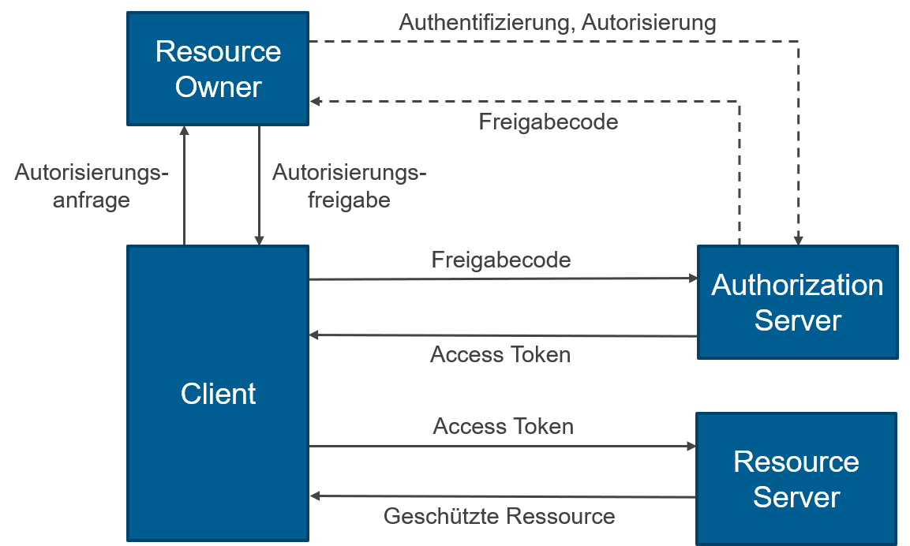

# 6.1.4.1 Funktionsweise

<figure><figcaption>
<a href="https://www.oose.de/wp-content/uploads/2019/05/OAuth2_Rollen-1.png">https://www.oose.de/wp-content/uploads/2019/05/OAuth2_Rollen-1.png</a>
</figcaption></figure>

1. User möchte sich bei unserer App via oAuth2 einloggen
2. unsere App (Client) stelle eine Autorisierungsanfrage an den User (Resource Owner)
3. User Authentifiziert sich gegenüber Authorization Server (bei uns Google oder Microsoft) und Autorisiert unser App auf bestimmte Daten zuzugreifen (bei uns nur allgemeine Profildaten (minimum))
4. Authorization Server erstellt einen Freigabecode und gibt diesen an den User (Ressource Owner) zurück
5. Der User gibt den Freigabecode als Autorisierungsfreigabe an unsere App (Client) zurück
6. unsere App (Client) gibt den Freigabecode an den Authorization Server (Google / Microsoft)
7. Authorization Server gibt an unsere App (Client) eine Access Token zurück
8. mit diesem Access Token kann sich unsere App vom Resource Server dann die entsprechenden Ressourcen abrufen
